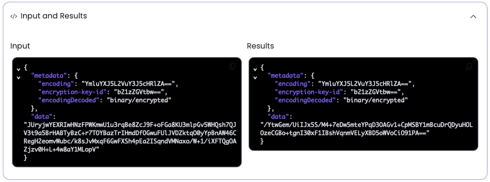
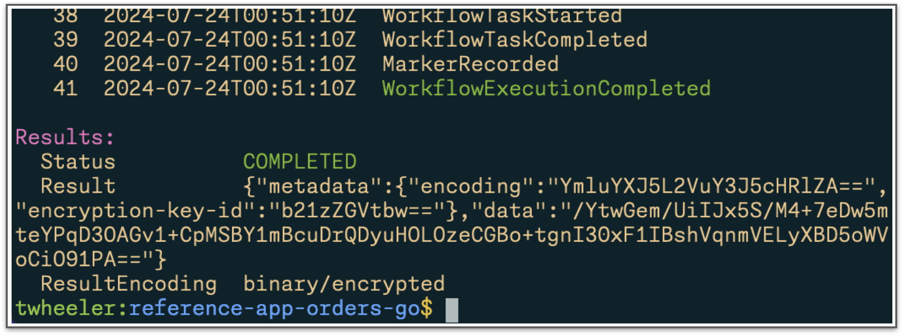

# Run the OMS Locally with Encryption

Follow these instructions to run the OMS locally, using 
a Custom Data Converter for data encryption and a Codec 
Server that will allow you to see the decrypted data in 
the Temporal CLI and Web UI. 

These instructions assume that the Temporal Service 
(either local or Temporal Cloud) is already running, 
but the OMS Workers and API Servers are not.

### Start the Workers

Run the following command in another terminal to start the Workers:

```command
go run ./cmd/oms worker -k omsdemo
```

This command starts the application's Workers, specifying an 
encryption key ID (`omsdemo`). As a result, the OMS creates
an instance of the Custom Data Converter and configures the 
Workers' Temporal Client to use it. This converter uses the 
specified ID to retrieve an encryption key, which it then 
uses to encrypt the payload data it sends to the Temporal 
Service. 


### Start the API Servers

Run the following command in another terminal to start the API Servers:

```command
go run ./cmd/oms api -k omsdemo
```

As with the command you used to start the Workers, this 
specifies the encryption key ID, which is then used to 
retrieve the key for encrypting payload data.


### Run the Web Application
You will need to clone the code for the web application, which is 
maintained separately in the [reference-app-orders-web](https://github.com/temporalio/reference-app-orders-web) repository:

```command
cd ..
git clone https://github.com/temporalio/reference-app-orders-web.git
```

Since the web application does not interact with the Temporal 
Service, you won't set an encryption key ID when starting it:

```command
cd reference-app-orders-web
pnpm install
pnpm dev
```


### Process an Order

Setup is now complete. The Temporal Client used by the OMS 
Workers and API Servers will now encrypt payload data.

The best way to observe this is by following the instructions 
for [processing a basic order](process-basic-order.md).

Continue with the next section after you've completed those 
steps.

### Observe the Encrypted Data

Access the Temporal Web UI, locate the Workflow Execution 
for the order you just processed, and then expand its 
**Input and Results** section. You should find that both 
the input and result are encrypted, similar to this:



You can also observe this by running the `temporal workflow show` 
command, specifying the Workflow ID for that execution. The output
will end with an encrypted result, similar to this:



This occurs because the data stored by the Temporal Service 
is encrypted. Neither the Temporal CLI nor Web UI have the 
inherent ability to decrypt it. However, you can run a Codec
Server and configure both tools to use it, which enable them
to display the decrypted data to you.

### Run the Codec Server

Run the following command in a new terminal window, modifying 
the URL provided in the `-u` option to reflect the base URL 
of your Temporal Web UI (it should not end with a slash):

```command
go run ./cmd/oms codec-server -u http://localhost:8080
```

This Codec Server will listen on port 8089 by default, but 
you can override this by using the `-p` option to specify 
a different port number. 


### Configure the Temporal CLI to use the Codec Server

Use the `temporal` command's `--codec-endpoint` option 
to specify the URL used to access your Codec Server, as 
in the following command:

```command
temporal workflow show \
    --workflow-id Order:A1-1721418536920 \
    --codec-endpoint http://localhost:8089/
```

You should then observe that data shown in the 
command's output has been decrypted for display.


### Configure the Temporal Web UI to use the Codec Server

Follow these steps to configure the Web UI to use your 
use your Codec Server:

1. Click the eyeglasses icon near the upper-right corner
   of the Temporal Web UI screen, which displays a form 
   you'll use to specify details about your Codec Server
2. Enter `http://localhost:8089` in the **Codec Server
   browser endpoint** field (note that this value does 
   not have a trailing slash)
3. Click the **Apply** button
4. You should observe that the glasses icon now has one
   purple lens and one green lens. A red icon indicates 
   that the Web UI can not communicate with your Codec 
   Server; if you see this, verified that you correctly 
   followed all of the previous steps.
5. Refresh the page and view the details of the Workflow 
   Execution for your order. You should find that the 
   data has been decrypted for display.


The Temporal Cloud Web UI provides additional options. As 
Temporal Cloud is a multi-tenant system, this includes the 
ability to configure a Codec Server on a per-Namespace 
basis, as [described in the documentation](https://docs.temporal.io/production-deployment/data-encryption#web-ui).

